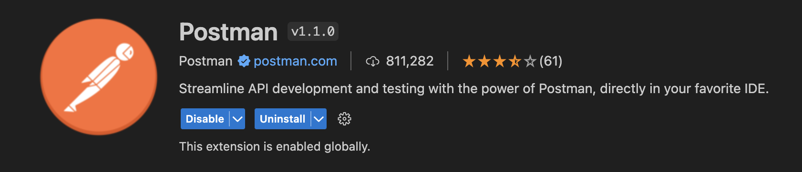
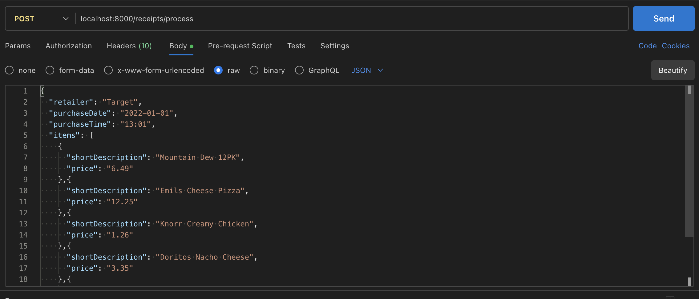
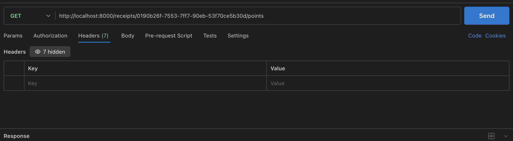

1. clone the repo
2. npm install

3. HOW_TO_TEST_APIS:

    a. install the following postman extension
        

    b. to start the server: npx ts-node src/index.ts 
    on using this command you will get a message :Server is running at http://localhost:8000
    NOTE: you can change the port by making changes to the .env file by updating the value for PORT=8000

    c. In the postman extension create a request as shown below. 
       
        NOTE: Paste sample receipt in the body and make sure you paste it in the raw format and it shows JSON format once you are done

    d. copy the id you get from the response

    e. create a get request with the id that you got from the response 
       
        NOTE: make sure you add the id you received from the post request

4. HOW_TO_RUN_TESTS:

    a. to run tests : npx jest   
    b. to check test coverage: npx jest --coverage